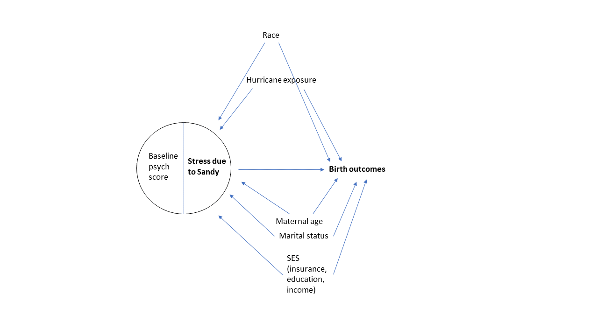

p8105\_hw6\_mgg2153
================
mggn
12/8/2020

### Final data science homework of the semester\!

Thank you, teaching team, for a great class.

Ok, let’s get started:

Problem 1 was completed in class, so I’ll jump right in to problem 2:

### Problem 2

Using the birthweight data set, we will (1) import the data (2) tidy the
data and (3) check for missing using a neat little function I found by
googling

``` r
bwt_df = 
  read_csv("./data/birthweight.csv") %>%
  janitor::clean_names() %>%
  mutate(
    mrace = as.factor(mrace),
    frace = as.factor(frace),
    babysex = as.factor(babysex),
    malform = as.factor(malform)
  )
```

    ## Parsed with column specification:
    ## cols(
    ##   .default = col_double()
    ## )

    ## See spec(...) for full column specifications.

``` r
sapply(bwt_df, function(x) sum(is.na(x))) #check missing
```

    ##  babysex    bhead  blength      bwt    delwt  fincome    frace  gaweeks 
    ##        0        0        0        0        0        0        0        0 
    ##  malform menarche  mheight   momage    mrace   parity  pnumlbw  pnumsga 
    ##        0        0        0        0        0        0        0        0 
    ##    ppbmi     ppwt   smoken   wtgain 
    ##        0        0        0        0

From the output, we can see that there are no missing values\! How nice.

#### Building a model

We are looking to construct a regression model to estimate birthweight.
Looking at the codebook, my variables of interest are:

  - gestational age (weeks)  
  - maternal race  
  - pre-pregnancy BMI  
  - SES (income used as proxy here)  
  - maternal age at delivery

**why?**

As part of my thesis, I was looking for birth outcomes after maternal
exposure to stress from natural disaster. The process for model building
included a theoretical framework as presented by the following DAG, and
influenced by other literature relating prenatal stress to birth
outcomes, namely, birthweight



Of course, the data we have here are different: we are looking at
factors that influence birth outcomes NOT in the context of natural
disaster\! Nevertheless, the DAG and the literature point to the
variables I listed above as being influential in determining
birthweight. Thus, I included them in my regression model below.
Additionally, I generated a plot of the residuals generated from my
model vs. the predicted values for the regression diagnostics plot

``` r
mg_model = lm(bwt ~ gaweeks+mrace+ppbmi+fincome+momage, data = bwt_df)
```

Model estimates are summarized below:

``` r
mg_model %>% broom::tidy()
```

    ## # A tibble: 8 x 5
    ##   term        estimate std.error statistic   p.value
    ##   <chr>          <dbl>     <dbl>     <dbl>     <dbl>
    ## 1 (Intercept)  535.      103.        5.18  2.29e-  7
    ## 2 gaweeks       59.2       2.21     26.8   9.15e-147
    ## 3 mrace2      -240.       16.1     -14.9   5.00e- 49
    ## 4 mrace3       -70.9      70.1      -1.01  3.12e-  1
    ## 5 mrace4      -155.       31.0      -5.01  5.66e-  7
    ## 6 ppbmi         15.8       2.17      7.28  3.90e- 13
    ## 7 fincome        0.558     0.294     1.90  5.74e-  2
    ## 8 momage        -0.238     1.95     -0.122 9.03e-  1

And here is the plot that I mentioned above\!

``` r
bwt_df %>%
  modelr::add_predictions(mg_model) %>%
  modelr::add_residuals(mg_model) %>%
  ggplot(aes(x = pred, y = resid))+geom_point()+#look back at regression notes :D
  geom_smooth(se = FALSE, method = "lm", color = "green")+
  theme_bw()+
  labs(
    x = "Residuals",
    y = "Predicted values",
    title = "Residuals vs. predicted values", #yhat?
    caption = "Regression diagnostics"
  )
```

    ## `geom_smooth()` using formula 'y ~ x'

<!-- -->
Looking at the plot, it looks like the residuals are symmetrical around
the line at y = 0. This kind of plot can be used to assess whether the
residuals from your regression are normally distributed. Since the
points are symmetrical, aka evenly distributed, it seems like the
residuals are evenly distributed and thus the normal distribution of
residuals assumption is satisfied for linear regression.

#### Model comparisons, cross-validation using modelr

Now we will cross-validate three models; the two below with the model I
constructed above

1)  
<!-- end list -->

``` r
#main effects model

main_effect = lm(bwt ~ blength + gaweeks, data = bwt_df)

main_effect %>% broom::tidy()
```

    ## # A tibble: 3 x 5
    ##   term        estimate std.error statistic  p.value
    ##   <chr>          <dbl>     <dbl>     <dbl>    <dbl>
    ## 1 (Intercept)  -4348.      98.0      -44.4 0.      
    ## 2 blength        129.       1.99      64.6 0.      
    ## 3 gaweeks         27.0      1.72      15.7 2.36e-54

2)  
<!-- end list -->

``` r
#head circumference, length, sex, and all interactions
saturated = lm(bwt ~ bhead*blength*babysex, data = bwt_df)

saturated %>% broom::tidy()
```

    ## # A tibble: 8 x 5
    ##   term                    estimate std.error statistic      p.value
    ##   <chr>                      <dbl>     <dbl>     <dbl>        <dbl>
    ## 1 (Intercept)            -7177.     1265.       -5.67  0.0000000149
    ## 2 bhead                    182.       38.1       4.78  0.00000184  
    ## 3 blength                  102.       26.2       3.90  0.0000992   
    ## 4 babysex2                6375.     1678.        3.80  0.000147    
    ## 5 bhead:blength             -0.554     0.780    -0.710 0.478       
    ## 6 bhead:babysex2          -198.       51.1      -3.88  0.000105    
    ## 7 blength:babysex2        -124.       35.1      -3.52  0.000429    
    ## 8 bhead:blength:babysex2     3.88      1.06      3.67  0.000245

**cross validation step**

``` r
cv_df =
  crossv_mc(bwt_df, 100)

cv_df = 
cv_df %>%
  mutate(
    mg_model = map(train, ~lm(bwt ~ gaweeks+mrace+ppbmi+fincome+momage, data = .x)),
    main_effect = map(train, ~lm(bwt ~ blength + gaweeks, data = .x)),
    saturated = map(train, ~lm(bwt ~ bhead*blength*babysex, data = .x))
  ) %>%
  mutate(
    rmse_mg_model = map2_dbl(mg_model, test, ~rmse(model = .x, data = .y)),
    rmse_main_effect = map2_dbl(main_effect, test, ~rmse(model = .x, data = .y)),
    rmse_saturated = map2_dbl(saturated, test, ~rmse(model = .x, data = .y))
  )
```

Look at distribution of RMSEs to see which model is best

``` r
cv_df %>% 
  select(starts_with("rmse")) %>% 
  pivot_longer(
    everything(),
    names_to = "model", 
    values_to = "rmse",
    names_prefix = "rmse_") %>% 
  mutate(model = fct_inorder(model)) %>% 
  ggplot(aes(x = model, y = rmse)) +
  geom_boxplot(aes(fill=model))+
  theme_bw()+
  labs(
    x = "Model",
    y = "RMSE",
    title = "RMSE distribution across 3 models"
  )+
  theme(legend.position = "none")
```

<!-- -->

Looks like the clear winner is the saturated model(we want the smallest
RMSE), with the three-way interaction\!

### Problem 3

Let’s load in the noaa data

``` r
weather_df = 
  rnoaa::meteo_pull_monitors(
    c("USW00094728"),
    var = c("PRCP", "TMIN", "TMAX"), 
    date_min = "2017-01-01",
    date_max = "2017-12-31") %>%
  mutate(
    name = recode(id, USW00094728 = "CentralPark_NY"),
    tmin = tmin / 10,
    tmax = tmax / 10) %>%
  select(name, id, everything())
```

    ## Registered S3 method overwritten by 'hoardr':
    ##   method           from
    ##   print.cache_info httr

    ## using cached file: C:\Users\MariaGuzman\AppData\Local\Cache/R/noaa_ghcnd/USW00094728.dly

    ## date created (size, mb): 2020-10-05 15:07:44 (7.537)

    ## file min/max dates: 1869-01-01 / 2020-10-31

``` r
set.seed(1)
```

Lets use bootstrap and generate models for tmax = tmin, then let’s pull
the estimates of the intercepts (b0) and the slopes (b1) and create the
log of the product of these two. Note: R uses log to mean natural log,
and log10 for log base 10. Since this is a biostats class, let’s use log
aka natural log :-)

Below is the process to summarize the 95% confidence interval

``` r
weather_df %>%
  bootstrap(n = 5000)%>%
  mutate(
    models = map(strap, ~lm(tmax ~ tmin, data = .x)),
    results = map(models, broom::tidy)
  ) %>%
  select(-strap, -models) %>%
  unnest(results) %>%
  select(.id, term, estimate)%>%
  pivot_wider(
    names_from = "term",
    values_from = "estimate"
  )%>%
  janitor::clean_names()%>%
  mutate(
    log_b_hats = log(intercept*tmin)
  )%>%
  summarize(
    lower_limit = quantile(log_b_hats, c(.025)),
    upper_limit = quantile(log_b_hats, c(.975))
  )%>%
  knitr::kable()
```

| lower\_limit | upper\_limit |
| -----------: | -----------: |
|     1.964949 |     2.058887 |

And now we follow a similar process for the r hat squared

``` r
weather_df %>%
  bootstrap(n = 5000)%>%
  mutate(
    models = map(strap, ~lm(tmax ~ tmin, data = .x)),
    results = map(models, broom::glance)
  ) %>%
  select(-strap, -models) %>%
  unnest(results) %>%
  janitor::clean_names()%>%
  summarize(
    lower_limit = quantile(r_squared, c(.025)),
    upper_limit = quantile(r_squared, c(.975))
  )%>% knitr::kable()
```

| lower\_limit | upper\_limit |
| -----------: | -----------: |
|    0.8933116 |    0.9272795 |

*and last but not least…* PLOTS of the distributions of the estimates\!

``` r
weather_df %>%
  bootstrap(n = 5000)%>%
  mutate(
    models = map(strap, ~lm(tmax ~ tmin, data = .x)),
    results = map(models, broom::tidy)
  ) %>%
  select(-strap, -models) %>%
  unnest(results) %>%
  select(.id, term, estimate)%>%
  pivot_wider(
    names_from = "term",
    values_from = "estimate"
  )%>%
  janitor::clean_names()%>%
  mutate(
    log_b_hats = log(intercept*tmin)
  )%>%
  ggplot(aes(x = log_b_hats))+geom_density()+theme_bw()+
  labs(
    x = "log(b0*b1)",
    y = "Density",
    title = "Distribution of [simulated] log(b0*b1) values"
  )
```

<!-- -->

``` r
weather_df %>%
  bootstrap(n = 5000)%>%
  mutate(
    models = map(strap, ~lm(tmax ~ tmin, data = .x)),
    results = map(models, broom::glance)
  ) %>%
  select(-strap, -models) %>%
  unnest(results) %>%
  janitor::clean_names()%>%
  ggplot(aes(x = r_squared))+geom_density()+theme_bw()+
  labs(
    x = "R (hat) squared",
    y = "Density",
    title = "Distribution of [simulated] R (hat) squared values"
  )
```

<!-- -->

Both plots look like a good old normal distribution :o)
