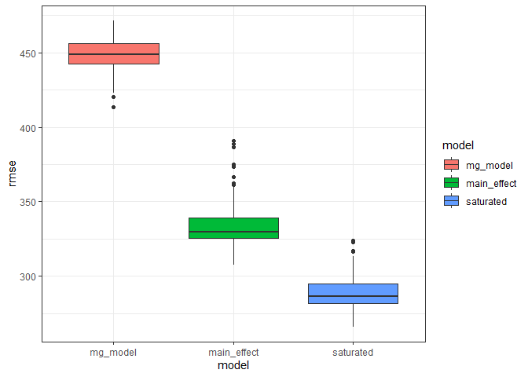

p8105\_hw6\_mgg2153
================
mggn
12/8/2020

### Problem 2

``` r
bwt_df = 
  read_csv("./data/birthweight.csv") %>%
  janitor::clean_names() %>%
  mutate(
    mrace = as.factor(mrace),
    frace = as.factor(frace),
    babysex = as.factor(babysex),
    malform = as.factor(malform)
  )
```

    ## Parsed with column specification:
    ## cols(
    ##   .default = col_double()
    ## )

    ## See spec(...) for full column specifications.

``` r
sapply(bwt_df, function(x) sum(is.na(x))) #looks like there are no missing values, let's build a model
```

    ##  babysex    bhead  blength      bwt    delwt  fincome    frace  gaweeks 
    ##        0        0        0        0        0        0        0        0 
    ##  malform menarche  mheight   momage    mrace   parity  pnumlbw  pnumsga 
    ##        0        0        0        0        0        0        0        0 
    ##    ppbmi     ppwt   smoken   wtgain 
    ##        0        0        0        0

``` r
#model based on information from my thesis, give justification later :D

mg_model = lm(bwt ~ gaweeks+mrace+ppbmi, data = bwt_df)

mg_model %>% broom::tidy()
```

    ## # A tibble: 6 x 5
    ##   term        estimate std.error statistic   p.value
    ##   <chr>          <dbl>     <dbl>     <dbl>     <dbl>
    ## 1 (Intercept)    556.      98.3       5.65 1.70e-  8
    ## 2 gaweeks         59.3      2.20     26.9  9.14e-148
    ## 3 mrace2        -251.      14.4     -17.4  1.31e- 65
    ## 4 mrace3         -77.6     69.5      -1.12 2.64e-  1
    ## 5 mrace4        -165.      30.5      -5.42 6.24e-  8
    ## 6 ppbmi           15.8      2.16      7.32 2.86e- 13

``` r
bwt_df %>%
  modelr::add_predictions(mg_model) %>%
  modelr::add_residuals(mg_model) %>%
  ggplot(aes(x = resid, y = pred))+geom_point()+#look back at regression notes :D
  geom_smooth(se = FALSE, method = "lm", color = "green")+
  theme_bw()+
  labs(
    x = "Residuals",
    y = "Predicted values",
    title = "Residuals vs. predicted values", #yhat?
    caption = "Regression diagnostics"
  )
```

    ## `geom_smooth()` using formula 'y ~ x'

<!-- --> \#\#\#\#
Model comparisons, cross-validation using modelr

``` r
#main effects model

main_effect = lm(bwt ~ blength + gaweeks, data = bwt_df)

main_effect %>% broom::tidy()
```

    ## # A tibble: 3 x 5
    ##   term        estimate std.error statistic  p.value
    ##   <chr>          <dbl>     <dbl>     <dbl>    <dbl>
    ## 1 (Intercept)  -4348.      98.0      -44.4 0.      
    ## 2 blength        129.       1.99      64.6 0.      
    ## 3 gaweeks         27.0      1.72      15.7 2.36e-54

``` r
#head circumference, length, sex, and all interactions
saturated = lm(bwt ~ bhead*blength*babysex, data = bwt_df)

saturated %>% broom::tidy()
```

    ## # A tibble: 8 x 5
    ##   term                    estimate std.error statistic      p.value
    ##   <chr>                      <dbl>     <dbl>     <dbl>        <dbl>
    ## 1 (Intercept)            -7177.     1265.       -5.67  0.0000000149
    ## 2 bhead                    182.       38.1       4.78  0.00000184  
    ## 3 blength                  102.       26.2       3.90  0.0000992   
    ## 4 babysex2                6375.     1678.        3.80  0.000147    
    ## 5 bhead:blength             -0.554     0.780    -0.710 0.478       
    ## 6 bhead:babysex2          -198.       51.1      -3.88  0.000105    
    ## 7 blength:babysex2        -124.       35.1      -3.52  0.000429    
    ## 8 bhead:blength:babysex2     3.88      1.06      3.67  0.000245

``` r
cv_df =
  crossv_mc(bwt_df, 100)

cv_df = 
cv_df %>%
  mutate(
    mg_model = map(train, ~lm(bwt ~ gaweeks+mrace+ppbmi, data = .x)),
    main_effect = map(train, ~lm(bwt ~ blength + gaweeks, data = .x)),
    saturated = map(train, ~lm(bwt ~ bhead*blength*babysex, data = .x))
  ) %>%
  mutate(
    rmse_mg_model = map2_dbl(mg_model, test, ~rmse(model = .x, data = .y)),
    rmse_main_effect = map2_dbl(main_effect, test, ~rmse(model = .x, data = .y)),
    rmse_saturated = map2_dbl(saturated, test, ~rmse(model = .x, data = .y))
  )
```

Look at distribution of RMSEs

``` r
cv_df %>% 
  select(starts_with("rmse")) %>% 
  pivot_longer(
    everything(),
    names_to = "model", 
    values_to = "rmse",
    names_prefix = "rmse_") %>% 
  mutate(model = fct_inorder(model)) %>% 
  ggplot(aes(x = model, y = rmse)) +
  geom_boxplot(aes(fill=model))+
  theme_bw()
```

<!-- -->

### Problem 3

Wow this looks like a fun one

``` r
weather_df = 
  rnoaa::meteo_pull_monitors(
    c("USW00094728"),
    var = c("PRCP", "TMIN", "TMAX"), 
    date_min = "2017-01-01",
    date_max = "2017-12-31") %>%
  mutate(
    name = recode(id, USW00094728 = "CentralPark_NY"),
    tmin = tmin / 10,
    tmax = tmax / 10) %>%
  select(name, id, everything())
```

    ## Registered S3 method overwritten by 'hoardr':
    ##   method           from
    ##   print.cache_info httr

    ## using cached file: C:\Users\MariaGuzman\AppData\Local\Cache/R/noaa_ghcnd/USW00094728.dly

    ## date created (size, mb): 2020-10-05 15:07:44 (7.537)

    ## file min/max dates: 1869-01-01 / 2020-10-31

``` r
set.seed(1)
```

For the log betas

``` r
weather_df %>%
  bootstrap(n = 5000)%>%
  mutate(
    models = map(strap, ~lm(tmax ~ tmin, data = .x)),
    results = map(models, broom::tidy)
  ) %>%
  select(-strap, -models) %>%
  unnest(results) %>%
  select(.id, term, estimate)%>%
  pivot_wider(
    names_from = "term",
    values_from = "estimate"
  )%>%
  janitor::clean_names()%>%
  mutate(
    log_b_hats = log(intercept*tmin)
  )%>%
  summarize(
    ll_ci = quantile(log_b_hats, c(.025)),
    ul_ci = quantile(log_b_hats, c(.975))
  )
```

    ## # A tibble: 1 x 2
    ##   ll_ci ul_ci
    ##   <dbl> <dbl>
    ## 1  1.96  2.06

For the r squared

``` r
weather_df %>%
  bootstrap(n = 5000)%>%
  mutate(
    models = map(strap, ~lm(tmax ~ tmin, data = .x)),
    results = map(models, broom::glance)
  ) %>%
  select(-strap, -models) %>%
  unnest(results) %>%
  janitor::clean_names()%>%
  summarize(
    ll_ci = quantile(r_squared, c(.025)),
    ul_ci = quantile(r_squared, c(.975))
  )
```

    ## # A tibble: 1 x 2
    ##   ll_ci ul_ci
    ##   <dbl> <dbl>
    ## 1 0.893 0.927
